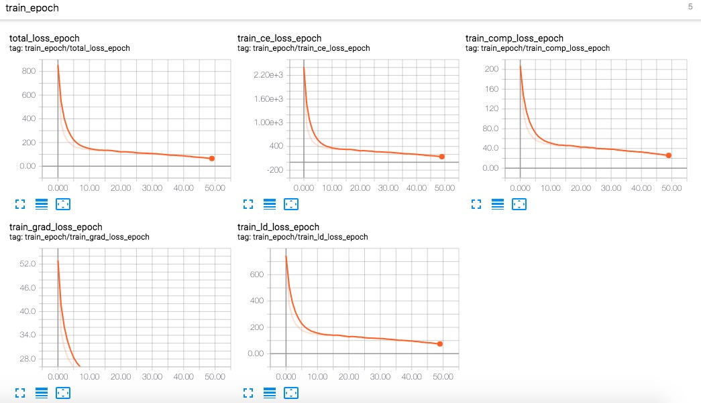
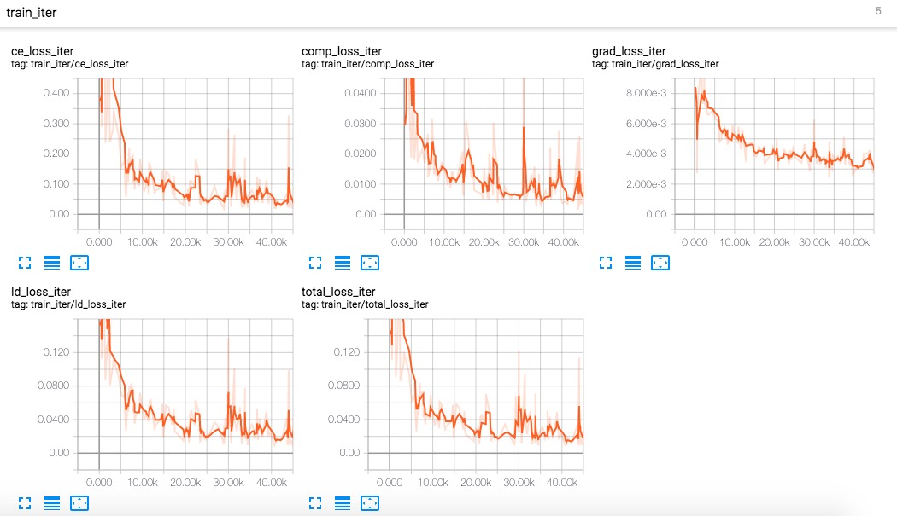
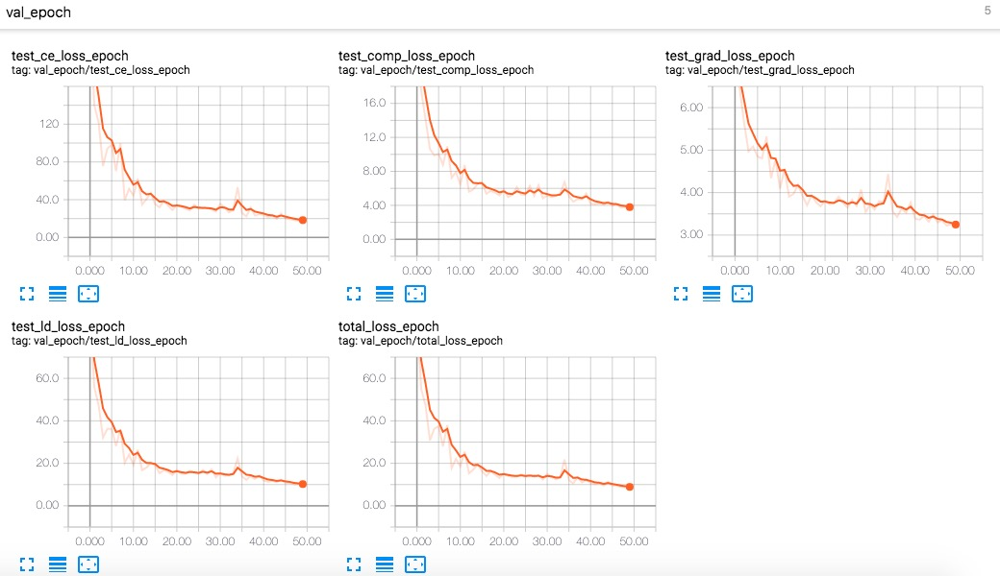
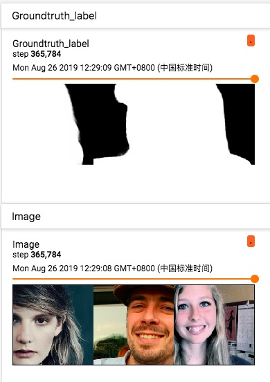
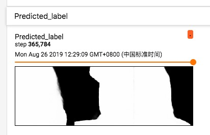

#### Deeplabv3+matte experiments：

- I transfered the semantic segmentation deeplabv3+ to matting task for high accuracy.
- Main modification:
  - Data processing including pre-processing and post-processing
  - Loss function which includes four parts: L_d loss, CE_loss, Gradients loss and Composition loss. References: [SHM-ACMM2018](https://arxiv.org/abs/1809.01354) and [Late-fusion-matting-CVPR2019](http://openaccess.thecvf.com/content_CVPR_2019/html/Zhang_A_Late_Fusion_CNN_for_Digital_Matting_CVPR_2019_paper.html)
  - Optimizer data related
- Based projrct: [pytorch-deeplab-xception](https://github.com/jfzhang95/pytorch-deeplab-xception).
- Training protocol:
  - Datasets: [Deep Automatic Portrait Matting](http://xiaoyongshen.me/webpages/webpage_automatting/) as portrait datasets and [aisegment](https://github.com/aisegmentcn/matting_human_datasets) as aisegmet datasets.
  - Pre-trained on aisegment datasets for 50 epochs and refine on portrait datasets for 100 epochs. **Note aisegment (34426 images) is more larger than portrait datasets (2000 images).**
  - Others setting follow the based project with a little modification.

------

#### Pre-trained on aisegment (dev-look-ahead):

- Training checkpoint: [epoch0-pth](pe-train_exp)

- [todo] Quantitative metrics overview

- TensorBoard overview

  ***Loss:***

  

  

  

  ***Example:***

  

  

  
